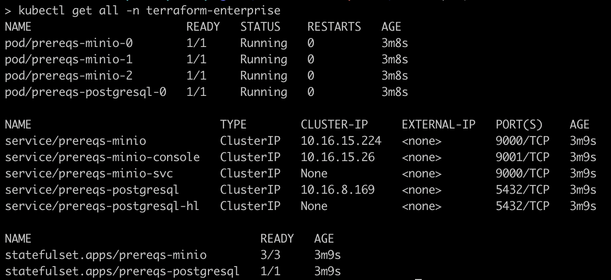
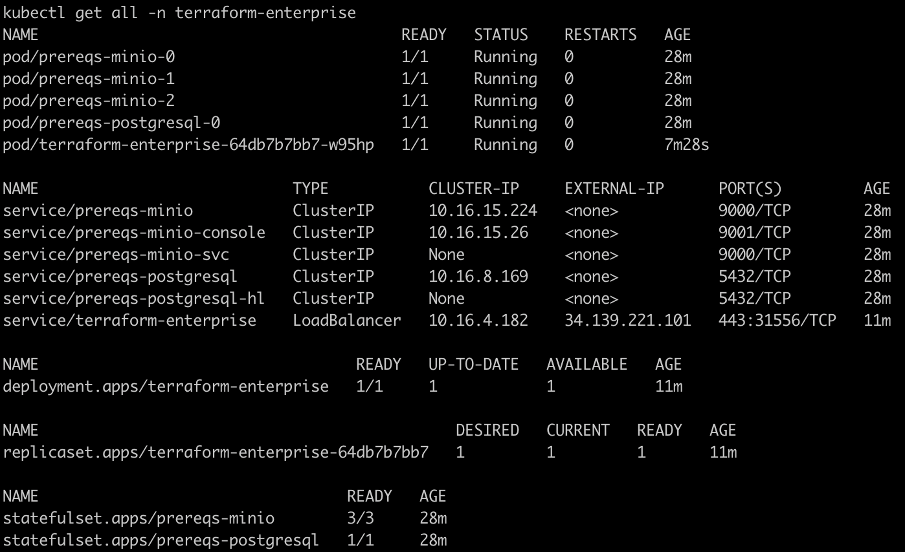

# Dependency Free Terraform Enterprise Quickstart Guide

## Background

The [external dependency requirements](../README.md#before-you-begin) for Terraform Enterprise can be a challenge to manage in a generic context since the answer is often to use cloud hosted services. This is the recommended solution for production workloads. This guide establishes a Terraform Enterprise instance while only provisioning resources within your Kubernetes cluster for testing and evaluation purposes.

We fulfill our external dependency needs like so:

| External Dependency | Solution |
| ------------------- | -------- |
| Database            | [PostgreSQL](https://github.com/bitnami/charts/tree/main/bitnami/postgresql) |
| S3 Compatible Storage | [MinIO](https://github.com/minio/minio/tree/master/helm/minio) |
| Redis | **N/A** |

This example is provisioning a single Terraform Enterprise pod in the `external` operational mode so Redis is not a necessary external dependency. The [Bitnami Redis chart](https://github.com/bitnami/charts/tree/main/bitnami/redis) can be used to fulfill this need if you'd like to extend the example into an `active-active` configuration.

## A Note on Kubernetes Internal DNS and Configuration Rigidity 

The namespace, helm release names, certificates and hostnames used in this example are selected to exploit the fact that given a kubernetes service with the following configuration:

```yaml
apiVersion: v1
kind: Service
metadata:
  name: alpha
  namespace: beta
spec:
  type: LoadBalancer
  selector:
    app.kubernetes.io/name: gamma
  ports:
    - protocol: TCP
      port: 80
```

Kubernetes will assign an internal dns address that is resolvable by all pods within the Kubernetes cluster of the form `alpha.beta.svc.cluster.local`. If Terraform Enterprise hosts traffic on this address then it is only necessary for a user to add a host file address to Terraform Enterprise, instead of a global dns address, like so:

```
##
# Host Database
#
# localhost is used to configure the loopback interface
# when the system is booting.  Do not change this entry.
##
127.0.0.1       localhost
255.255.255.255 broadcasthost
::1             localhost

163.243.34.56 terraform-enterprise.terraform-enterprise.svc.cluster.local
```

Given that we are not owners of this reserved root DNS address we are going to use a locally provisioned CA certificate to sign a public/private key pair. This tutorial includes all the necessary configuration and certificates assuming the following configuration:

| Configuration | Value                  |
| ---------     | ---------------------- |
| Namespace     | `terraform-enterprise` |
| Hostname      | `terraform-enterprise.terraform-enterprise.svc.cluster.local` | 
| Certificates  | The values listed in [override.yaml](./example/override.yaml) at `.tls` |
| Prerequisite Chart Release Name | `prereqs` |
| Terraform Enterprise Release Name | `terraform-enterprise` |

Any deviation from these settings could cause:
* Internal DNS addresses to not match up with the example configuration for dependencies
* TLS certificates to not match terraform-enterprise hostnames 

This quick start guide assumes this configuration does not change. If you do modify any of these take care to update other configuration to match the resulting DNS addresses and/or generate your own certificates matching the resulting service hostnames.

## Namespace and Image Pull Secrets

Let's start by creating our namespace and create our `ImagePullSecret` for Terraform Enterprise. Replace `REGISTRY_URL`, `REGISTRY_USERNAME`, and `REGISTRY_PASSWORD` appropriately.

```
kubectl create namespace terraform-enterprise
kubectl create secret docker-registry terraform-enterprise --docker-server=REGISTRY_URL --docker-username=REGISTRY_USERNAME --docker-password=REGISTRY_PASSWORD  -n terraform-enterprise
```

Copy the [override.yaml](./example/override.yaml) file and modify the `image.repository` and `image.name` attributes to reflect the container registry you use in your ImagePullSecret. This tutorial will assume the path to this override file is `/tmp/override.yaml` in the subsequent code snippets.

## Prerequisite Resources

There is a `terraform-enterprise-prereqs` chart included in the documentation examples. This chart installs PostgreSQL and MinIO in a minimal non-production grade configuration that is sufficient for basic testing of terraform-enterprise.

```shell
helm dependency update ./docs/example/terraform-enterprise-prereqs
helm install prereqs ./docs/example/terraform-enterprise-prereqs  -n terraform-enterprise --wait
```
> :information: This tutorial assumes commands are executed from the root directory of this repository. Please update relative paths to helm charts in the example commands if you are operating from another filesystem location.

When this operation is complete your namespace resources should look something like this:


You now have PostgreSQL listening on address `prereqs-postgresql.terraform-enterprise.svc.cluster.local` and MinIO listening on address `http://prereqs-minio.terraform-enterprise.svc.cluster.local:9000`.

## Provisioning Terraform Enterprise

Now that the prerequisite services are installed, operational, and listening on the expected dns addresses we can install Terraform Enterprise.  Review your copy of `override.yaml` before installing Terraform Enterprise. Install the terraform-enterprise chart:

```shell
helm install terraform-enterprise . -n terraform-enterprise --values /tmp/override.yaml --wait
```

Once this operation is complete you should have a terraform-enterprise pod in a ready state with a passing health check!


## Create a MinIO Bucket for TFE

We need a bucket in MinIO in order for Terraform Enterprise to manage run configuration. We'll spin up a MinIO control pod, authenticate, and create a bucket:

```shell
# This creates a mc pod that will clean itself up when we exit
kubectl run mc-shell --rm -i --tty -n terraform-enterprise  --image minio/mc --command /bin/bash
```

Once this pod loads we can create our bucket:
```shell
mc alias set home http://prereqs-minio.terraform-enterprise.svc.cluster.local:9000 tfeclusteradmin 'Terraform-Enterprise!'
mc mb tfe
# This should show a tfe directory if all went well
mc ls
```

## Set up your local connectivity

We need to establish communication with Terraform Enterprise to continue. This will involve:

* Installing the included CA certificate into your local CA certificates or keystore
* Creating a host file entry for the load balancer for Terraform Enterprise
* Testing your connection to Terraform Enterprise by inspecting the `_health_check` endpoint of Terraform Enterprise with `curl`
* Creating an administrative account and authenticating to Terraform Enterprise in the browser.

If you do not wish to install the included CA certificate feel free to generate a new TLS key set, including a CA certificate. Alternatively you could execute this configuration and testing procedure inside an isolated virtual machine.

### Local Connectivity Step 0: Install the CA Certificate

> :warning: If you are uncomfortable making the following CA certificate file changes or want to confirm the validity of the procedure please consult your local IT staff.

There is a CA certificate included in this repository [here](./example/ca-certificate.pem). Install this CA certificate by whatever means your workstation operating system expects. On MacOS we need to open the Keychain Access application and drag the CA cert into the System zone.  We then open the Get Info interface on the Hashicorp DevTest certificate and update the trust to Always.

### Local Connectivity Step 1: Create a Host File Entry

Determine the ip address of the load balancer. If you're using a local kubernetes implementation like MinIO this might require that you explicitly expose or proxy the LoadBalancer service first in order to get an accessible ip address.

```shell
kubectl get service terraform-enterprise -n terraform-enterprise
```
which should return something like:
```
NAME                   TYPE           CLUSTER-IP     EXTERNAL-IP    PORT(S)         AGE
terraform-enterprise   LoadBalancer   10.16.15.120   34.75.115.85   443:30147/TCP   46s
```

Now add a host file entry on your workstation for this external ip address:
```
34.75.115.85  terraform-enterprise.terraform-enterprise.svc.cluster.local
```

and validate this address with curl:
```shell
> curl https://terraform-enterprise.terraform-enterprise.svc.cluster.local/_health_check
OK
```

## Test Drive Terraform Enterprise!

Follow the steps in [Create an Administrative User](../README.md#create-an-administrative-user) to set up your access with Terraform Enterprise. You're all set to set up a workspace and try some plans and applies. When you're done you may do the following to undo the work we've done here:

* `kubectl delete namespace terraform-enterprise`
* delete the Hashicorp DevTest CA certificate from your CA certificate store
* remove the host file entry added for Terraform Enterprise

Happy Terraforming!